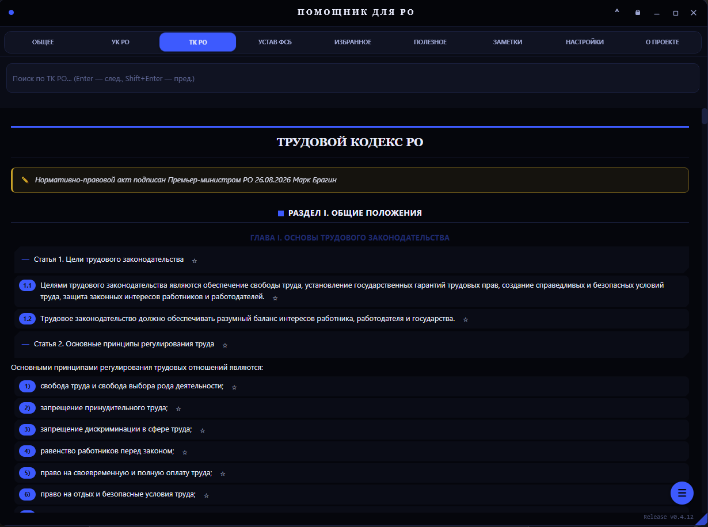
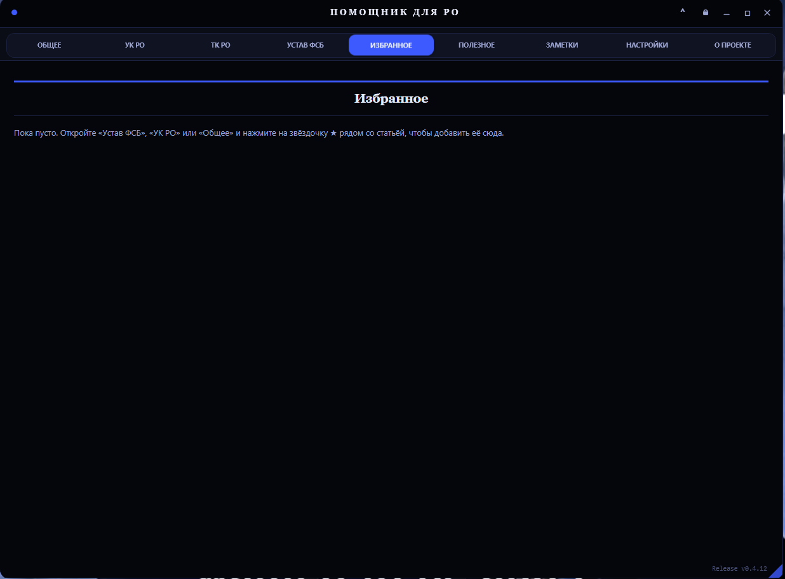
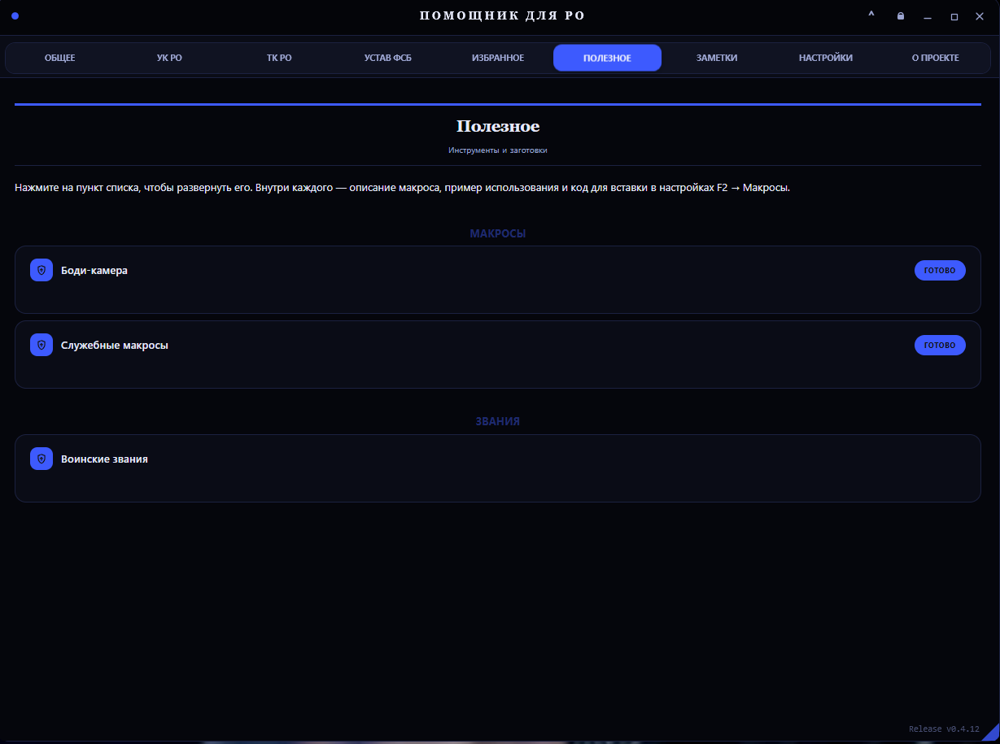
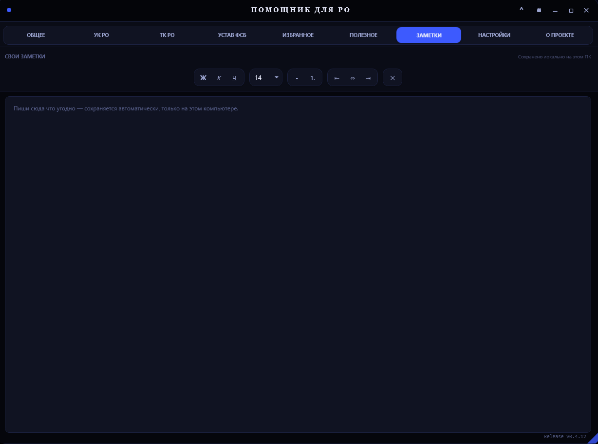

# Помощник для РО

**Оверлей-помощник для сотрудников ФСБ на сервере «Россия Онлайн» — Кутузовский**

Устав, УК, ТК, макросы и настройки — прямо поверх игры, без переключения окон.

[**Скачать последнюю версию**](../../releases/latest) · [Сайт проекта](https://helperro.netlify.app/) · [Discord-мейнтейнеры](#команда)

---

## О проекте

**Помощник для РО** — компактное тёмное окно, которое можно закрепить поверх игры. Не нужно сворачивать клиент, чтобы свериться со статьёй устава, найти нужный пункт УК/ТК или запустить заготовку отыгровки — всё доступно в один хоткей.

## Возможности

| Модуль | Описание |
|---|---|
| 📖 **Устав ФСБ** | Полный текст устава фракции с быстрым поиском по разделам |
| ⚖️ **УК РО** | Уголовный кодекс сервера — статьи, сроки и санкции без переключения окон |
| 💼 **ТК РО** | Трудовой кодекс сервера — то же самое удобство поиска и навигации |
| 🗂 **Общее** | Миранда, порядок задержания, права задержанного, кодекс этики |
| ⭐ **Избранное** | Закрепляй нужные статьи звёздочкой — быстрый доступ без повторного поиска |
| 🧰 **Полезное** | Готовые макросы (боди-камера, служебные) и справочник воинских званий |
| 📝 **Заметки** | Свои заметки с форматированием, сохраняются локально на этом ПК |
| 🎨 **Настройки** | 9 стилей текста, темы оформления, размер и прозрачность окна, автозапуск, свои горячие клавиши |
| 🔄 **Автообновление** | Приложение само проверяет и предлагает установить новую версию — скачанный файл проверяется по контрольной сумме (SHA-256) перед установкой |

## Скриншоты

<table>
<tr>
<td> Общее</td>
<td> УК РО</td>
<td> ТК РО</td>
</tr>
<tr>
<td> Устав ФСБ</td>
<td> Избранное</td>
<td> Полезное</td>
</tr>
<tr>
<td> Заметки</td>
<td> Настройки</td>
<td> О проекте</td>
</tr>
</table>

## Скачать

Готовые сборки — на странице **[Releases](../../releases)**. Файл `HelperGos.exe` — самодостаточный, ничего дополнительно распаковывать не нужно.

Зеркала на случай проблем с доступом к GitHub:

- Яндекс.Диск: https://disk.yandex.ru/d/rcNRU6IoAKc-Hg
- Google Диск: https://drive.google.com/drive/folders/1NLbrBjAYa9duZ_gFSAFlhS7nBRIasveK?usp=sharing

## Требования

- Windows 10/11 (x64)
- .NET 10 Desktop Runtime — если не установлен, приложение предложит поставить его автоматически при первом запуске

## Установка

1. Скачай `HelperGos.exe` из [Releases](../../releases/latest).
2. Запусти файл.
3. Если Windows SmartScreen/браузер покажет предупреждение — это стандартная реакция на новый неподписанный файл без истории репутации, не вирус. Жми «Подробнее» → «Выполнить в любом случае» (или аналог).

Файл версии 0.4.13 [проверен на VirusTotal](https://www.virustotal.com/gui/file/6c44ddddf7803d22a32cdb03a6b4d7e7bd2cacc50b25614ff929bf2d0585eee9?nocache=1) — 0 из 70+ антивирусов не обнаружили угроз. *(ссылка будет обновлена после проверки нового exe)*

## Горячие клавиши

По умолчанию окно вызывается клавишей **Ё** (можно поменять в настройках приложения). Отдельно настраиваются клавиши блокировки окна, быстрого перехода в «Избранное» и в «Заметки».

## Сборка из исходников

Требуется .NET 10 SDK и Windows (используется WPF + WebView2).

## Команда

| Роль | Ник |
|---|---|
| Разработка | **Денис** — Discord: `roste233` |
| Разработка | **Михаил** — Discord: `accapura` |

## Лицензия

Проект распространяется бесплатно для игроков сервера «Россия Онлайн».

---

Помощник для РО · Россия Онлайн · Кутузовский

