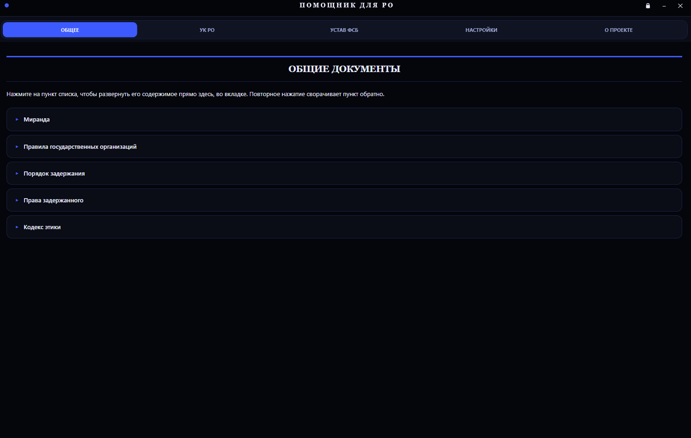
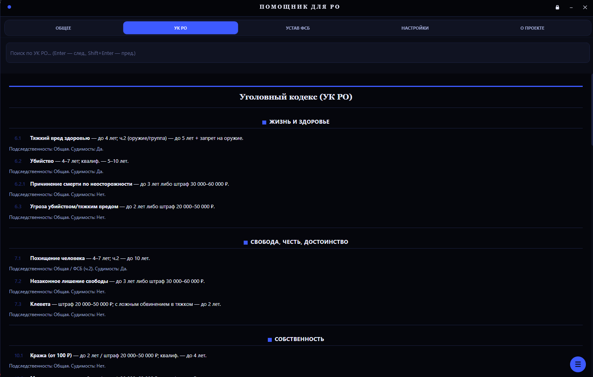
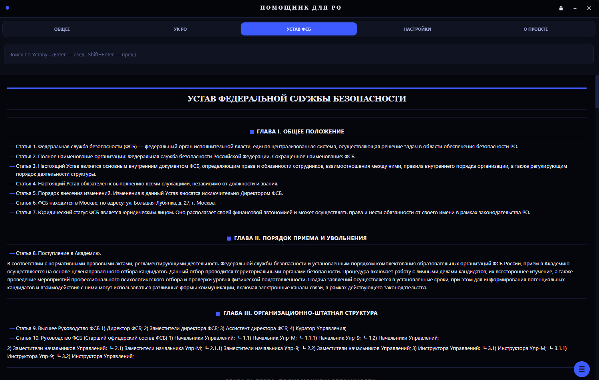
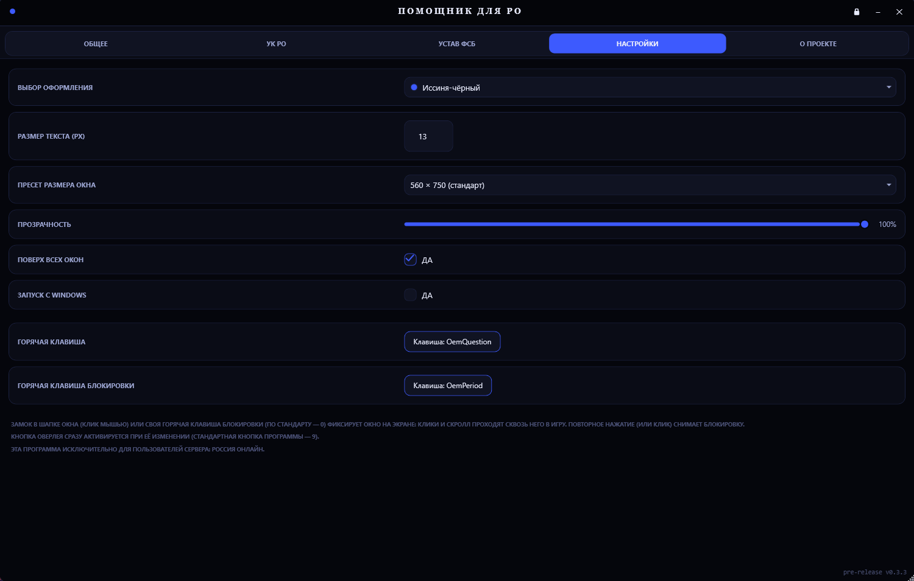
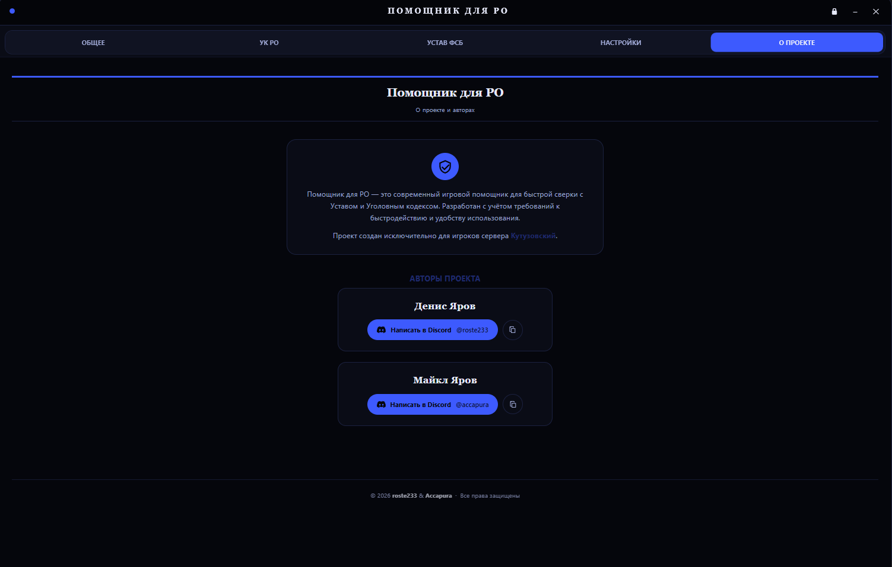

<div align="center">


# Помощник для РО

**Оверлей-помощник для сотрудников ФСБ на сервере «Россия Онлайн» — Кутузовский**

Устав, УК, макросы и настройки — прямо поверх игры, без переключения окон.

[](../../releases/latest)
[](#-требования)
[](#-требования)
[](../../releases/latest)

[**Скачать последнюю версию**](../../releases/latest) · [Сайт проекта](https://helperro.netlify.app/) · [Discord-мейнтейнеры](#-команда)

</div>

---

## О проекте

**Помощник для РО** — компактное тёмное окно, которое можно закрепить поверх игры. Не нужно сворачивать клиент, чтобы свериться со статьёй устава, найти нужный пункт УК или запустить заготовку отыгровки — всё доступно в один хоткей.

## Возможности

| Модуль | Описание |
|---|---|
| 📖 **Устав ФСБ** | Полный текст устава фракции с быстрым поиском по разделам |
| ⚖️ **УК РО** | Уголовный кодекс сервера — статьи, сроки и санкции без переключения окон |
| 🗂 **Общее** | Миранда, порядок задержания, права задержанного, кодекс этики |
| 🎨 **Настройки** | 13 тем оформления, размер и прозрачность окна, автозапуск, свои горячие клавиши |
| 🔄 **Автообновление** | Приложение само проверяет и предлагает установить новую версию |

## Скриншоты

<table>
<tr>
<td><br><sub>Общее</sub></td>
<td><br><sub>УК РО</sub></td>
<td><br><sub>Устав ФСБ</sub></td>
</tr>
<tr>
<td><br><sub>Настройки</sub></td>
<td><br><sub>О проекте</sub></td>
<td></td>
</tr>
</table>

## Скачать

Готовые сборки — на странице **[Releases](../../releases)**. Файл `HelperGos.exe` — самодостаточный, ничего дополнительно распаковывать не нужно.

Зеркала на случай проблем с доступом к GitHub:

- Яндекс.Диск: https://disk.yandex.ru/d/rcNRU6IoAKc-Hg
- Google Диск: https://drive.google.com/drive/folders/1NLbrBjAYa9duZ_gFSAFlhS7nBRIasveK?usp=sharing

## Требования

- Windows 10/11 (x64)
- .NET 8 Desktop Runtime — если не установлен, приложение предложит поставить его автоматически при первом запуске

## Установка

1. Скачай `HelperGos.exe` из [Releases](../../releases/latest).
2. Запусти файл.
3. Если Windows SmartScreen/браузер покажет предупреждение — это стандартная реакция на новый неподписанный файл без истории репутации, не вирус. Жми «Подробнее» → «Выполнить в любом случае» (или аналог).

## Горячие клавиши

По умолчанию окно вызывается клавишей **9** (можно поменять в настройках приложения).

## Сборка из исходников

```bash
git clone https://github.com/Accapura/Helper_RO_App.git
cd Helper_RO_App
dotnet publish -c Release -r win-x64 --self-contained true
```

Требуется .NET 8 SDK и Windows (используется WPF + WebView2).

## Команда

| Роль | Ник |
|---|---|
| Разработка | **Денис Яров** — Discord: `roste233` |
| Разработка | **Майкл Яров** — Discord: `accapura` |

## Лицензия

Проект распространяется бесплатно для игроков сервера «Россия Онлайн». Открытый исходный код — для ознакомления и локальной сборки.

---

<div align="center">
<sub>Помощник для РО · Россия Онлайн · Кутузовский</sub>
</div>
